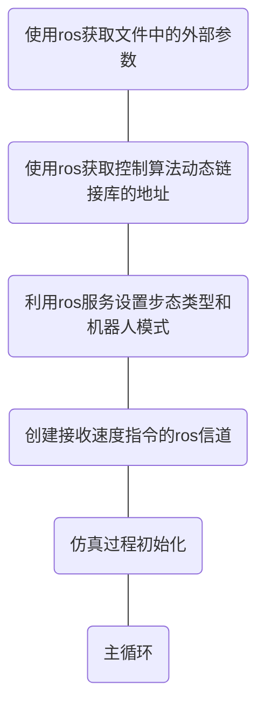
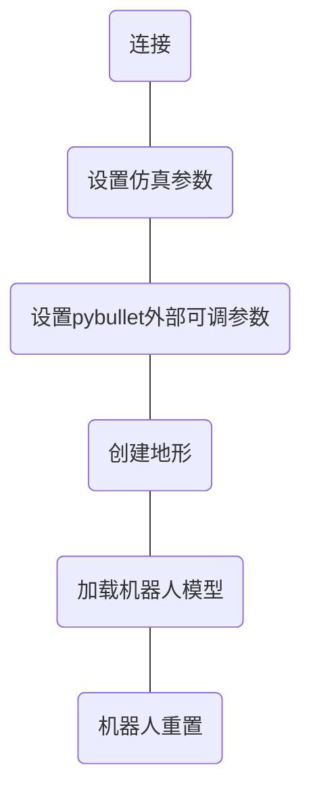
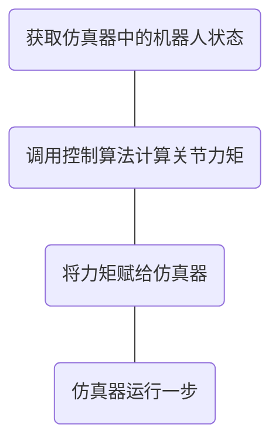

# cheetah-software的使用示例


Derek-TH-Wang/quadruped_ctrl (https://github.com/Derek-TH-Wang/quadruped_ctrl)

中对cheetah-software的使用为模块化的利用其中的控制部分提供了一个非常好的范例。下面对其中的方法进行提炼：


## 主要思想

quadruped_ctrl 是基于双语言编程（c++和python），pybullet仿真环境，ros中间件对MIT的cheetah-software进行改造。

首先，用基于pybullet的仿真模型代替MIT自己编程实现的仿真模型。从仿真引擎来说，仿真效果比原来的自编模型应该是更好的（更逼真，更有说服力）。仿真接口用python实现，也更加灵活。

其次，基于双语言编程（c++和python），利用原cheetah-software中的控制部分c++程序实现控制算法库，即降低了工作量也保持的算法运行速度；利用python实现仿真接口和外部主流程，高效又灵活。不过，双语言编程的门槛高了些。对于编程能力不足的人，这一点还是难以做到的。

最后，利用ros代替lcm来接收和发布消息，更加的通用。


## 关键技术


### 编译

quadruped_ctrl 程序是按ros模块组织各个部分的。程序的编译使用catkin_make指令。幸运的是，catkin_make指令除了与ros相关的部分，与cmake基本一致，这使quadruped_ctrl 对进一步的改造有很大的意义。

编译的配置信息都在主目录下的CMakeLists.txt文件中。


```cmake
cmake_minimum_required(VERSION 3.0.2)
project(quadruped_ctrl)

set(CMAKE_BUILD_TYPE "Release")

include_directories(
  src
)

add_subdirectory(src/qpOASES)
add_subdirectory(src/JCQP)
add_subdirectory(src/osqp)

## Declare a C++ library
add_library(${PROJECT_NAME}
  src/MPC_Ctrl/ConvexMPCLocomotion.cpp
  src/MPC_Ctrl/Gait.cpp
  src/MPC_Ctrl/SparseCMPC.cpp
  src/MPC_Ctrl/SparseCMPC_Math.cpp
  src/MPC_Ctrl/OsqpTriples.cpp
  src/MPC_Ctrl/convexMPC_interface.cpp
  src/MPC_Ctrl/SolverMPC.cpp
  src/MPC_Ctrl/RobotState.cpp
  src/Controllers/FootSwingTrajectory.cpp
  src/Controllers/LegController.cpp
  src/Controllers/DesiredStateCommand.cpp
  src/Controllers/OrientationEstimator.cpp
  src/Controllers/PositionVelocityEstimator.cpp
  src/Controllers/SafetyChecker.cpp
  src/Dynamics/Quadruped.cpp
  src/Dynamics/FloatingBaseModel.cpp
  src/GaitCtrller.cpp
)

target_link_libraries(${PROJECT_NAME}
  ${catkin_LIBRARIES}
  JCQP
  qpOASES
  osqp
)

catkin_install_python(PROGRAMS
   scripts/walking_simulation.py 
   DESTINATION ${CATKIN_PACKAGE_BIN_DESTINATION}
 )
```


可以看到，编译信息非常简单清晰。其中，依赖的jcqp、qpoases、osqp都是源码编译的，对应的编译信息在相应的子目录中。在主目录的CMakeLists.txt文件中只要增加对应的子目录，并制定链接库目标即可。


编译完成后会得到libjcqp.so，libosqp.so，libqpoases.so，libquadruped_ctrl.so四个动态链接库，保存在/devel/lib文件夹中。


### python编写的主流程


主流程是python程序/scripts/walking_simulation.py。





主流程中，“仿真过程初始化”和“主循环”是使用pybullet和cheetah-software控制模块的核心部分。

（1）仿真过程初始化过程





（2）主循环过程


主循环每次都获取pybullet外部参数，以便判断是否重置仿真过程或改变机器人模式。然后调用控制过程run()。

控制过程为：





从主循环中对于控制算法的调用来看，控制算法完全是独立的模块，使用方便。


