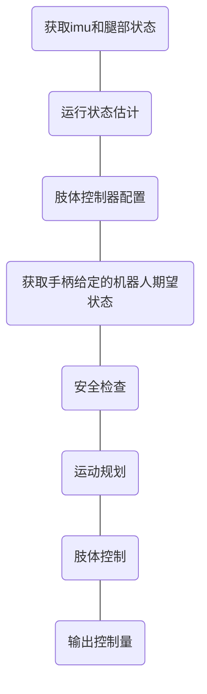
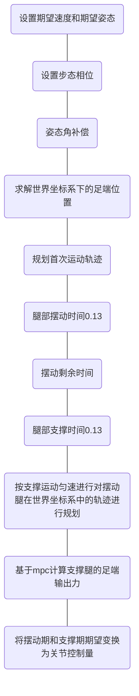

# trace back for control signal

从外部接口调用反向查找控制信号的来源。以便将腿部控制更换为单纯的位置指令。

## （1）每次运行控制算法时调用的是动态连接库的接口函数toque_calculator()

加载动态连接库时会构造GaitCtrller类。

## （2）toque_calculator()直接调用GaitCtrller类的ToqueCalculator()函数，该函数根据imu和腿部状态计算关节控制量。

GaitCtrller类是参考项目编制的外部类，包含的成员变量包括：四足模型Quadruped，规划算法ConvexMPCLocomotion，肢体控制LegController，状态估计StateEstimatorContainer和StateEstimate等。

## （3）GaitCtrller类的ToqueCalculator()调用流程

调用流程中，肢体控制器配置、获取期望状态、运动规划和肢体控制比较重要。

### 肢体控制器配置

完成腿部数据获取、运动学计算、输出清零、使能和设置最大输出力矩的功能。

运动学计算得到足端位置和速度。

设置最大输出力矩是计算用的，并不是仿真参数。

### 获取期望状态

根据手柄指定stateDes的数据

0，1，2为位置

3，4，5为姿态

### 运动规划

根据运动模型、机器人状态、期望状态、和各种模式信息，计算控制规划。

### 肢体控制

根据规划中设定的期望足端位置和期望支撑力，计算各关节的控制量。

