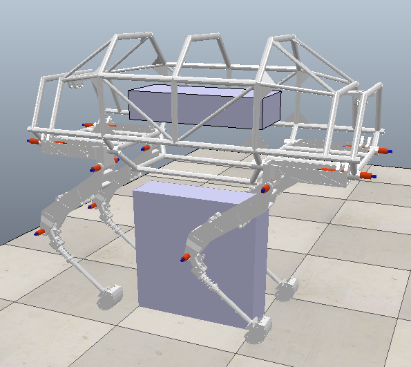
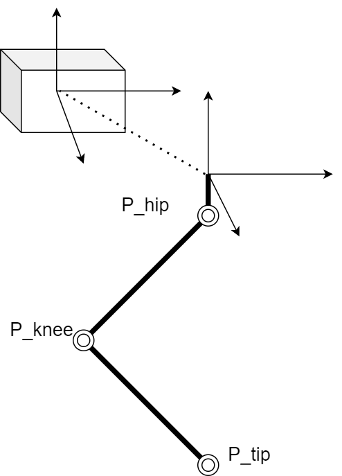

# vrep model of IronHorse

## 方法

使用简单构件形成机器人的物理动态，使用SolidWorks导出的stl文件实现外观显示。

## 参数

### 重量
本体（Body）重量：10kg

髋部（Hip）重量：0.3kg

大腿（Thigh）重量：0.5kg

小腿（Shank）重量：0.66kg

### 尺寸

以本体质心坐标系为基准，右侧向为x轴，前向为y轴，z轴指向上方，表示为$O-X_b Y_b Z_b$。

在髋侧关节轴与髋前关节轴交汇的位置，建立与本体坐标系指向一致的肢体坐标系$O-X_{li} Y_{li} Z_{li}$。

下述位置信息为腿2相对于本质质心坐标系（单位米）：

肢体坐标系原点位置：（0.18，0.315，-0.145）

髋部高度为：0.06

大腿长度为：0.4

小腿长度为：0.372

对应腿2的肢体坐标系原点位置，假设本体质心坐标系原点也在几何中心，则：

腿1的肢体坐标系原点位置：（-0.18，0.315，-0.145）

腿3的肢体坐标系原点位置：（-0.18，-0.315，-0.145）

腿1的肢体坐标系原点位置：（0.18，-0.315，-0.145）

