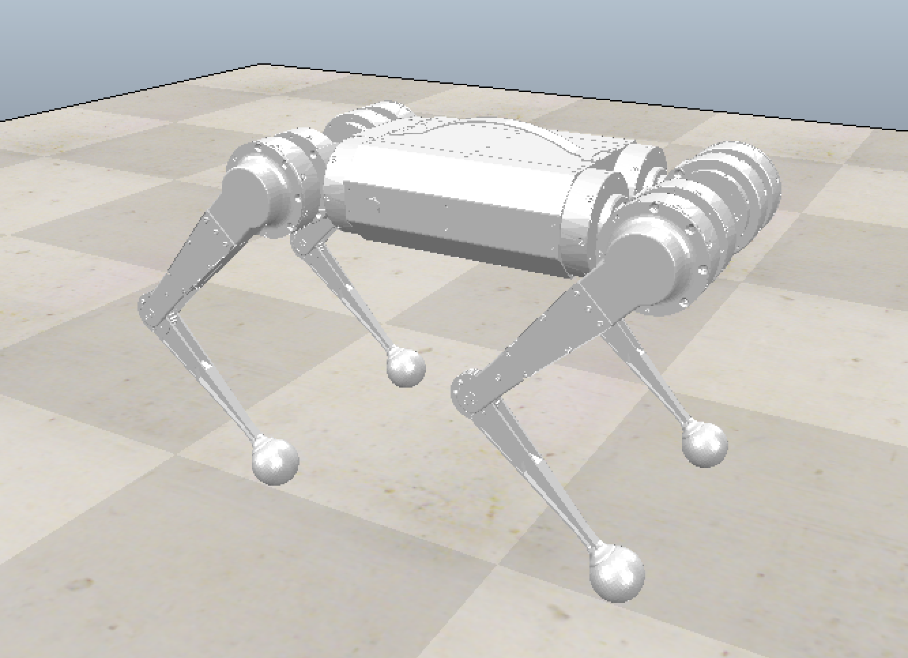
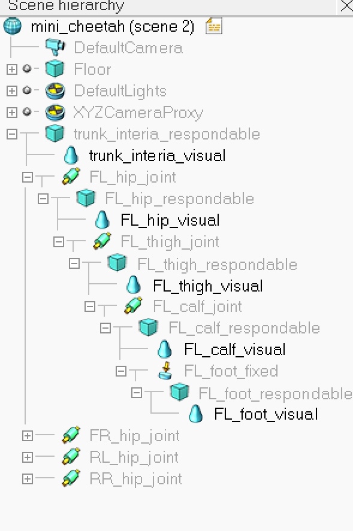

# vrep model of mini-cheetah

使用vrep的urdf导入工具，直接导入广泛使用的mini_cheetah模型，然后再根据需要修改。

经过几次尝试，[chvmp](https://github.com/chvmp)/**[mini-cheetah-gazebo-urdf](https://github.com/chvmp/mini-cheetah-gazebo-urdf)**可以使用。

该机器人模型的用途是验证控制算法，因此对原系统进行精简，去掉传感器、摄像机等等附件。

